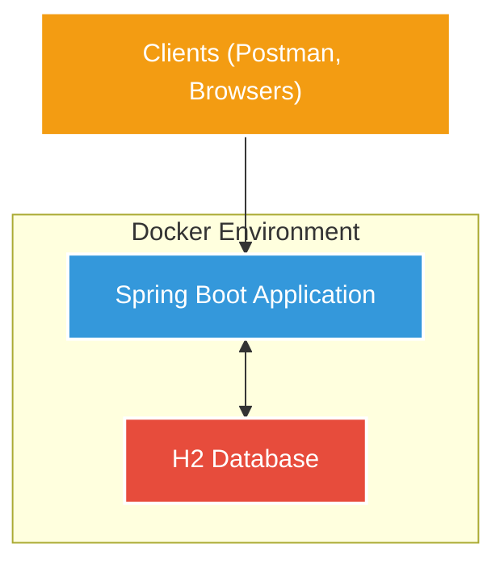

# Projeto: Mesa Facil - API para gestao de usuarios para Restaurantes

## 1. Introdução

### Descrição do problema
Na nossa região, um grupo de restaurantes decidiu desenvolver um sistema compartilhado de gestão para seus estabelecimentos. A iniciativa surgiu da necessidade de reduzir custos com sistemas individuais, permitindo que os restaurantes foquem em sua especialidade culinária enquanto oferecem uma experiência digital consistente. Este sistema unificado permitirá que os clientes escolham restaurantes com base na comida oferecida, em vez da qualidade dos sistemas digitais.

### Objetivo do projeto
Desenvolver um backend robusto utilizando Spring Boot para gerenciar usuários, incluindo operações CRUD completas e validação de login. O sistema será containerizado com Docker e utilizará um banco de dados H2 para persistência de dados, com foco na primeira fase do projeto que contempla o gerenciamento de usuários.

## 2. Arquitetura do Sistema

### Descrição da Arquitetura
O projeto Mesa Facil segue uma arquitetura em camadas, aplicando o padrão MVC adaptado para APIs REST:

- **Controller Layer**: Responsável por receber as requisições HTTP, validar os inputs e direcionar para os serviços apropriados.
- **Service Layer**: Contém a lógica de negócio, orquestrando as operações e interagindo com os repositórios.
- **Repository Layer**: Responsável pela persistência e recuperação de dados do banco H2.
- **Model/Entity Layer**: Representa as entidades de domínio e suas relações.
- **DTO Layer**: Objetos de transferência de dados que isolam a API externa das entidades internas.

A aplicação está containerizada com Docker, utilizando um container para a aplicação Spring Boot e outro para o banco de dados H2. A comunicação é estabelecida via Docker Compose, garantindo isolamento e facilidade de implantação.

### Diagrama da Arquitetura



## 3. Descrição dos Endpoints da API

### Tabela de Endpoints

| Endpoint | Método | Descrição |
|----------|--------|-----------|
| `/api/v1/users` | GET | Lista todos os usuários ativos, com suporte a paginação |
| `/api/v1/users/{id}` | GET | Busca um usuário específico pelo ID |
| `/api/v1/users` | POST | Cria um novo usuário |
| `/api/v1/users/{id}` | PUT | Atualiza os dados de um usuário existente |
| `/api/v1/users/{id}/password` | PATCH | Altera a senha de um usuário |
| `/api/v1/users/{id}` | DELETE | Exclui (inativa) um usuário |
| `/api/v1/users/login` | POST | Autentica um usuário verificando login e senha |

### Exemplos de requisição e resposta

#### Criar usuário (POST /api/v1/users)

**Requisição:**
```json
{
    "nome": "Maria Silva",
    "email": "maria.silva@example.com",
    "login": "mariasilva",
    "senha": "senha123",
    "tipoUsuario": "USUARIO_COMUM",
    "endereco": {
        "logradouro": "Rua das Flores",
        "numero": "123",
        "cep": "12345678",
        "complemento": "Apto 101",
        "bairro": "Centro",
        "cidade": "São Paulo",
        "uf": "SP"
    }
}
```

**Resposta (201 Created):**
```json
{
    "id": 1,
    "nome": "Maria Silva",
    "email": "maria.silva@example.com",
    "login": "mariasilva",
    "tipoUsuario": "USUARIO_COMUM"
}
```

#### Login (POST /api/v1/users/login)

**Requisição:**
```json
{
    "login": "mariasilva",
    "senha": "senha123"
}
```

**Resposta (200 OK):**
```json
{
    "sucesso": true,
    "mensagem": "Login realizado com sucesso"
}
```

## 4. Configuração do Projeto

### Configuração do Docker Compose

O arquivo `docker-compose.yml` orquestra dois serviços principais:

```yaml
version: '3.8'

services:
  # Serviço da API
  mesafacil-api:
    build:
      context: .
      dockerfile: Dockerfile
    container_name: mesafacil-api
    ports:
      - "8080:8080"
    depends_on:
      - h2-database
    environment:
      - SPRING_DATASOURCE_URL=jdbc:h2:tcp://h2-database:1521/mesafacil
      - SPRING_DATASOURCE_USERNAME=admin
      - SPRING_DATASOURCE_PASSWORD=admin
      - SPRING_DATASOURCE_DRIVER_CLASS_NAME=org.h2.Driver
      - SPRING_H2_CONSOLE_ENABLED=true
      - MESAFACIL_OPENAPI_DEV_URL=http://localhost:8080
    networks:
      - mesafacil-network
    restart: unless-stopped

  # Serviço do banco H2
  h2-database:
    image: oscarfonts/h2
    container_name: h2-database
    ports:
      - "8082:8082"  # Interface web do H2
      - "1521:1521"  # Porta TCP para conexão
    environment:
      - H2_OPTIONS=-ifNotExists
    volumes:
      - h2-data:/opt/h2-data
    networks:
      - mesafacil-network
    restart: unless-stopped

networks:
  mesafacil-network:
    driver: bridge

volumes:
  h2-data:
```

Este arquivo define:
- Um container para a aplicação Spring Boot exposto na porta 8080
- Um container para o banco de dados H2 exposto nas portas 8082 (console web) e 1521 (porta TCP)
- Uma rede compartilhada para comunicação entre os containers
- Um volume persistente para armazenar os dados do H2

### Instruções para execução local

1. Clone o repositório:
   ```bash
   git clone https://github.com/MSFelisberto/mesa-facil.git
   cd mesafacil
   ```

2. Execute com Docker Compose:
   ```bash
   docker-compose up -d
   ```

3. Acesse as interfaces:
   - API: http://localhost:8080
   - Swagger UI: http://localhost:8080/swagger-ui.html
   - H2 Console: http://localhost:8080/h2-console (ou http://localhost:8082)
     - JDBC URL: jdbc:h2:tcp://h2-database:1521/mesafacil
     - Usuário: admin
     - Senha: admin

## 5. Qualidade do Código

### Boas Práticas Utilizadas

O projeto implementa vários princípios SOLID:

1. **Princípio da Responsabilidade Única (SRP)**:
   - Cada classe tem uma única responsabilidade (Controllers, Services, Repositories)
   - DTOs separados para diferentes operações (CreateUserDTO, UpdateUserDataDTO)

2. **Princípio Aberto/Fechado (OCP)**:
   - Uso de interfaces para repositories, permitindo extensão sem modificação

3. **Princípio da Inversão de Dependência (DIP)**:
   - Injeção de dependências via construtores
   - Dependência de abstrações (interfaces) em vez de implementações concretas

Além disso, aplicamos:
- **Validação de dados**: Uso de anotações como @NotBlank, @Email, @Size
- **Documentação da API**: Integração com Swagger/OpenAPI
- **Logs estruturados**: Uso de SLF4J para registro de operações importantes
- **Tratamento global de exceções**: Implementação de GlobalExceptionHandler
- **Exclusão lógica**: Usuários são marcados como inativos em vez de removidos do banco

## 6. Collections para Teste

### Link para a Collection do Postman

A collection do Postman está disponível no repositório, no arquivo `MesaFacil.postman_collection.json`.

### Como importar e usar a collection:

1. Abra o Postman
2. Clique em "Import" no canto superior esquerdo
3. Arraste o arquivo `MesaFacil.postman_collection.json` ou navegue até ele
4. Após importar, você verá a collection "MesaFacil API" no painel lateral
5. Expanda a pasta "Usuários" para ver todos os endpoints disponíveis

### Descrição dos Testes Manuais

Para testar os endpoints:

1. **Criar usuário**: Execute o request "Criar Novo Usuário", que criará um usuário na base
2. **Listar usuários**: Execute "Listar Todos os Usuários" para verificar a criação
3. **Buscar usuário**: Use "Buscar Usuário por ID" com o ID retornado na criação
4. **Atualizar usuário**: Execute "Atualizar Usuário" modificando algum dado
5. **Alterar senha**: Use "Alterar Senha do Usuário" para atualizar a senha
6. **Login**: Tente fazer login com "Login de Usuário" usando as credenciais
7. **Excluir usuário**: Execute "Excluir Usuário" para remover o registro

## 7. Repositório do Código

### URL do Repositório

O código completo está disponível em: [https://github.com/MSFelisberto/mesa-facil](https://github.com/MSFelisberto/mesa-facil)

### Estrutura do Repositório

```
mesafacil/
├── src/
│   ├── main/
│   │   ├── java/br/com/fiap/mesafacil/
│   │   │   ├── config/            # Configurações da aplicação
│   │   │   ├── controllers/       # Controladores REST
│   │   │   ├── dtos/              # Objetos de transferência de dados
│   │   │   ├── entities/          # Entidades JPA
│   │   │   ├── enums/             # Enumerações
│   │   │   ├── repositories/      # Repositórios JPA
│   │   │   ├── services/          # Camada de serviços
│   │   │   └── mesafacilApplication.java  # Classe principal
│   │   └── resources/             # Arquivos de configuração
│   └── test/                      # Testes da aplicação
├── Dockerfile                     # Build da imagem Docker
├── docker-compose.yml             # Orquestração dos containers
├── mesafacil.postman_collection.json  # Collection para testes
├── README.md                      # Documentação
└── pom.xml                        # Configuração Maven
```

